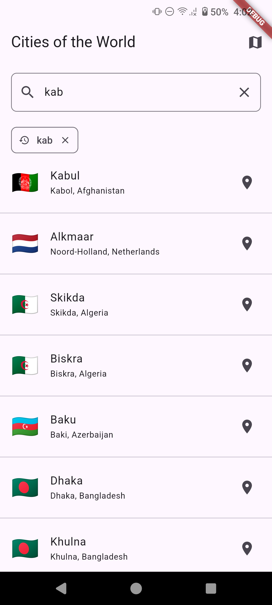
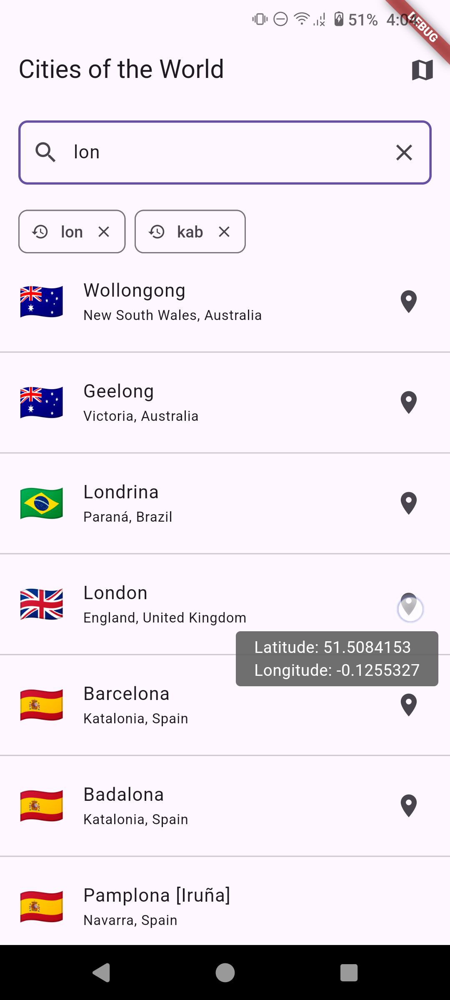
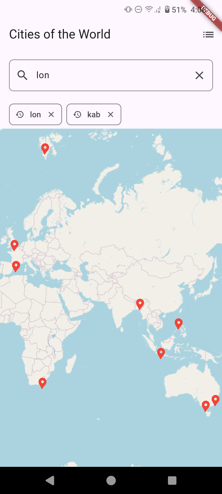
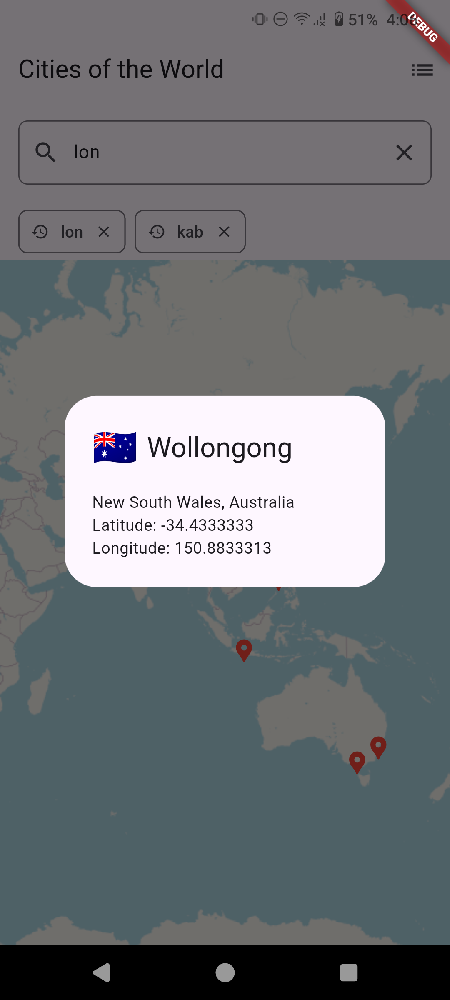

# Cities Of The World

A Flutter application that displays cities from around the world, with features for searching, viewing on a map, and managing search history.

## Prerequisites

Before you begin, ensure you have met the following requirements:

- Flutter 3.24.3

## Architecture

This project follows Clean Architecture principles, organized into three main layers:

- **Data Layer**: Handles external interactions (API calls, local storage)
- **Domain Layer**: Contains business logic and models
- **Presentation Layer**: Manages UI components and state

The project uses the BLoC pattern (specifically Cubit) for state management, providing a clean separation between UI and business logic.

## Project Structure

The project is organized as follows:

```sh
lib/
├── core/
│   ├── constants/
│   ├── errors/
│   └── utils/
├── data/
│   ├── datasources/
│   │   ├── local/
│   │   └── remote/
│   └── repositories/
├── domain/
│   ├── models/
│   └── repositories/
├── presentation/
│   ├── cubits/
│   └── pages/
└── di/

```

## Dependencies

- **dio**: For making HTTP requests.
- **hive**: For local data storage.
- **get_it & injectable**: For dependency injection.
- **flutter_bloc**: For state management.
- **freezed**: For generating immutable data classes and utility methods.
- **flutter_map**: For displaying maps.
- **world_countries**: For country flags.


## Getting Started

To get a local copy up and running, follow these steps:

1. **Clone the repository:**

```sh
git clone https://github.com/talhakerpicci/cities-of-the-world
cd cities-of-the-world
```

2. **Install dependencies:**

```sh
flutter pub get
```

3. **Generate code:**

```sh
flutter pub run build_runner build --delete-conflicting-outputs
```

4. **Run the app:**

```sh
flutter run
```

## Screenshots

<p float="left">
  
   
  
  
</p>

## Demo Video

For a full app walkthrough, check out the demo video below:

<a href="screenshots/video.mp4">
  
</a>
